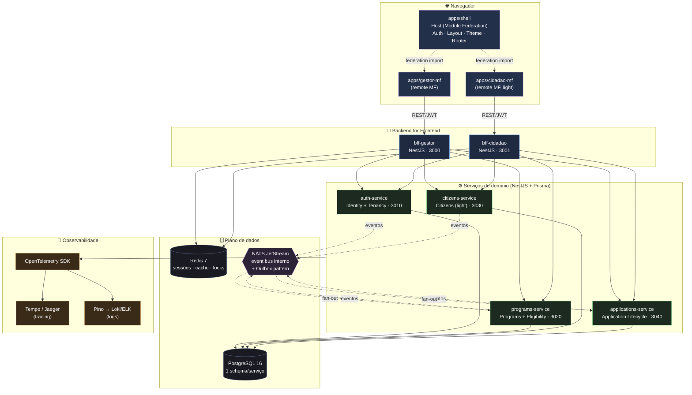
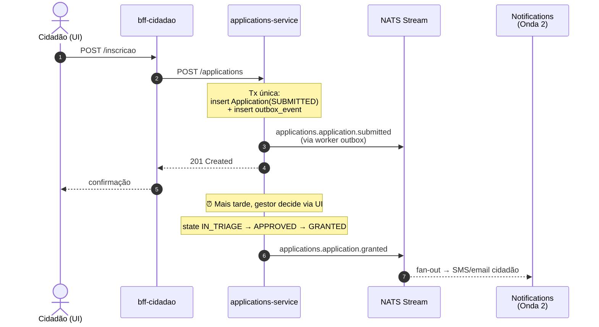

<div align="center">

# +Inclusão

**Promovendo inclusão, garantindo direitos e consolidando uma governança pública orientada por evidências, equidade e transformação social.**

<!-- ─── Status & metadados do projeto ───────────────────────────── -->

[](#estado-atual)
[](./LICENSE)
[](./CODE-OF-CONDUCT.md)
[](https://www.conventionalcommits.org/)
[](./CONTRIBUTING.md#padrões-de-commit-conventional-commits--dco)
[](https://github.com/changesets/changesets)
[](https://semver.org/)
[](./CHANGELOG.md)

<!-- ─── Compromissos sociais & legais ────────────────────────────── -->

[](#acessibilidade)
[](./SECURITY.md#privacidade-e-lgpd)
[](./docs/legal/ropa.md)
[](./CODE-OF-CONDUCT.md)

<!-- ─── Stack técnica ────────────────────────────────────────────── -->

[](.nvmrc)
[](https://pnpm.io)
[](https://www.typescriptlang.org)
[](https://nestjs.com/)
[](https://react.dev/)
[](https://rspack.dev/)
[](https://module-federation.io/)
[](https://tailwindcss.com/)
[](https://www.prisma.io/)
[](https://www.postgresql.org/)
[](https://nats.io/)
[](https://redis.io/)
[](https://turbo.build/)
[](./docs/adr/0010-dev-container-purista.md)

<!-- ─── CI & automação (ativam ao primeiro run dos workflows) ────── -->

[](https://github.com/olucianochagas/mais-inclusao/actions/workflows/ci.yml)
[](https://github.com/olucianochagas/mais-inclusao/actions/workflows/codeql.yml)
[](https://github.com/olucianochagas/mais-inclusao/actions/workflows/e2e.yml)
[](./.github/dependabot.yml)
[](https://eslint.org/)
[](https://prettier.io/)

<!-- ─── Atividade do repositório (live) ──────────────────────────── -->

[](https://github.com/olucianochagas/mais-inclusao/commits/main)
[](https://github.com/olucianochagas/mais-inclusao/pulse)
[](https://github.com/olucianochagas/mais-inclusao/issues)
[](https://github.com/olucianochagas/mais-inclusao/pulls)
[](https://github.com/olucianochagas/mais-inclusao/labels/good%20first%20issue)
[](https://github.com/olucianochagas/mais-inclusao/labels/help%20wanted)

</div>

---

## Sumário

- [Visão e missão](#visão-e-missão)
- [Para quem é](#para-quem-é)
- [Estado atual](#estado-atual)
- [Arquitetura](#arquitetura)
- [Stack tecnológico](#stack-tecnológico)
- [Início rápido](#início-rápido)
- [Como contribuir](#como-contribuir)
- [Comunidade e suporte](#comunidade-e-suporte)
- [Acessibilidade](#acessibilidade)
- [Privacidade e LGPD](#privacidade-e-lgpd)
- [Roadmap](#roadmap)
- [Licença](#licença)
- [Agradecimentos](#agradecimentos)

---

## Visão e missão

O **+Inclusão (mais-inclusao)** é uma plataforma SaaS multi-tenant de **governança pública para inclusão social**. Permite a secretarias, ONGs e consórcios públicos:

- Configurar e operar **programas e benefícios sociais** com critérios transparentes de elegibilidade.
- Receber **inscrições omnichannel** (cidadão pelo portal, gestor pelo backoffice, integrações externas via ETL).
- Realizar **triagem, concessão e entrega** de benefícios com trilha auditável.
- Produzir **indicadores e evidências** que sustentem políticas públicas equitativas.
- Garantir **direitos do titular de dados** (LGPD) com transparência e acessibilidade plenas.

A missão é ampla, mas o foco do produto é estreito: **operacionalizar o ciclo programa → inscrição → triagem → concessão → entrega**, com tudo o mais (case management, BI, encaminhamentos) orbitando esse núcleo.

### Valores que orientam decisões técnicas

| Valor                           | Impacto concreto                                                                                                                                                                                                   |
| ------------------------------- | ------------------------------------------------------------------------------------------------------------------------------------------------------------------------------------------------------------------ |
| **Equidade**                    | Critérios de elegibilidade visíveis e auditáveis. Sem black-box.                                                                                                                                                   |
| **Acessibilidade**              | WCAG 2.2 AA não é feature; é definição de pronto. Libras, audiodescrição e linguagem cidadã evoluem por ondas.                                                                                                     |
| **Privacidade desde o desenho** | PII em coluna criptografada com chave por tenant. Consentimento granular. ROPA versionado.                                                                                                                         |
| **Transparência**               | Decisões arquiteturais ficam em [`docs/superpowers/specs/`](./docs/superpowers/specs/) e em ADRs em [`docs/adr/`](./docs/adr). Discussões em PRs públicos.                                                         |
| **Sustentabilidade**            | Microsserviços extraídos por evidência, não por especulação ([gatilhos documentados](./docs/superpowers/specs/2026-05-16-programa-mais-inclusao-decomposicao.md#seção-6--ondas-seguintes-e-gatilhos-de-extração)). |

---

## Para quem é

| Persona                                | O que faz no +Inclusão                                                                      |
| -------------------------------------- | ------------------------------------------------------------------------------------------- |
| **Gestor público / técnico social**    | Cria programas, define critérios, triagem e concessão de benefícios, acompanha indicadores. |
| **Cidadão atendido**                   | Descobre programas, autoinscreve-se, exerce direitos LGPD, acompanha status.                |
| **Operador SaaS**                      | Provisiona tenants, monitora saúde da plataforma, audita, gerencia billing.                 |
| **Contribuidor técnico / pesquisador** | Estende a plataforma, contribui com módulos, melhora a11y, audita segurança.                |

**Não é** para: substituir CadÚnico, SUAS, SUS ou sistemas oficiais. **É** para complementá-los oferecendo a camada operacional, transparente e acessível que muitos órgãos ainda constroem em planilhas e formulários soltos.

---

## Estado atual

> ⚠️ **Pre-alpha** — Setembro de 2026 marca o início do projeto. Esta é a fase de fundação:
>
> - ✅ **Spec de decomposição aprovada** ([leia aqui](./docs/superpowers/specs/2026-05-16-programa-mais-inclusao-decomposicao.md)) — 22 bounded contexts mapeados, 3 ondas evolutivas, Onda 1 detalhada.
> - 🚧 **Implementação da Onda 1** — primeiro subprojeto será iniciado em breve. Acompanhe pelas [issues marcadas com `wave-1`](https://github.com/olucianochagas/mais-inclusao/labels/wave-1).
> - ⏳ **Sem releases ainda.** Não há binários, imagens Docker ou pacotes publicados.
> - 🎯 **Buscamos contribuidores** — especialmente em a11y, LGPD, design inclusivo, NestJS, React/Module Federation. Ver [CONTRIBUTING.md](./CONTRIBUTING.md).

---

## Arquitetura

O +Inclusão segue **microsserviços evolutivos por bounded context** sobre um monorepo Turborepo. Frontends são **micro frontends Module Federation 2.0**. Para o panorama completo, leia a [spec de decomposição](./docs/superpowers/specs/2026-05-16-programa-mais-inclusao-decomposicao.md) e os [ADRs](./docs/adr/).

### Topologia da Onda 1



### Fluxo de inscrição omnichannel (saga coreografada)



> Detalhes em [ADR-0001](./docs/adr/0001-microsservicos-evolutivos-por-bounded-context.md) (microsserviços evolutivos), [ADR-0004](./docs/adr/0004-nats-jetstream-outbox-pattern.md) (Outbox Pattern) e na [spec § 2 e § 4](./docs/superpowers/specs/2026-05-16-programa-mais-inclusao-decomposicao.md).

**Princípios técnicos não-negociáveis:**

1. **Multi-tenant via discriminator** `tenant_id` em toda tabela, com 6 camadas de defesa em profundidade.
2. **Contratos públicos versionados** em `packages/contracts`. Quebras viram PR explícito com [Changeset](https://github.com/changesets/changesets).
3. **Eventos via Outbox Pattern** — consistência transacional sem 2PC.
4. **Serviços de domínio não chamam outros serviços de domínio diretamente** — só via eventos + read models locais.
5. **PII criptografada em coluna** com chave por tenant via KMS/Vault.

---

## Stack tecnológico

### Backend

- **Runtime:** Node.js ^24.15.0 (corepack)
- **Linguagem:** TypeScript 5.6+ (strict)
- **Framework:** NestJS 11
- **ORM:** Prisma 6
- **Banco:** PostgreSQL 16 (1 schema por serviço)
- **Mensageria:** NATS JetStream
- **Cache/sessão:** Redis 7
- **Validação:** Zod
- **Auth:** OIDC interno, JWT, argon2id

### Frontend

- **UI:** React 19 (CSR)
- **Bundler:** Rspack + Module Federation 2.0
- **Router:** React Router v7
- **State:** TanStack Query v5 + Zustand
- **Estilo:** Tailwind CSS 4 + shadcn/ui (copiado em `packages/ui`)
- **Forms:** React Hook Form + Zod
- **i18n:** react-i18next (pt-BR)
- **A11y:** @axe-core/playwright no CI

### Plataforma

- **Monorepo:** Turborepo 2.9 + pnpm 11.1.2 (via corepack)
- **Testes:** Vitest + RTL + Testcontainers + Pact + Playwright
- **Observabilidade:** Pino + OpenTelemetry + Tempo/Jaeger
- **CI:** GitHub Actions
- **Updates:** Dependabot
- **Versionamento:** Changesets + Conventional Commits

---

## Início rápido

### Pré-requisitos

- **Docker** e **Docker Compose** (recomendamos Docker Desktop 4.30+ ou Docker Engine 26+)
- **Node.js ^24.15.0** com `corepack` habilitado (não é necessário instalar pnpm manualmente; o corepack baixa a versão correta)
- **Git 2.40+**
- Acessibilidade ao seu próprio terminal: leitores de tela, alto contraste, zoom — todos devem funcionar.

### Setup

```bash
# 1. Clonar
git clone git@github.com:olucianochagas/mais-inclusao.git
cd mais-inclusao

# 2. Habilitar corepack (uma vez por máquina)
corepack enable

# 3. Instalar dependências (corepack baixa pnpm@11.1.2 automaticamente)
pnpm install

# 4. Subir a infraestrutura de dev (Postgres, Redis, NATS, MailHog, Jaeger, MinIO)
#    apps NestJS e MF serão adicionados nos próximos ciclos
pnpm infra:up

# 5. Aplicar migrations e popular dados de demo
pnpm db:migrate
pnpm seed

# 6. Levantar todos os serviços em modo dev (orquestrado pelo Turbo)
pnpm dev
```

### Endpoints úteis (dev)

| Serviço                | URL                          |
| ---------------------- | ---------------------------- |
| Shell + Gestor MF      | http://localhost:5173/gestor |
| Shell + Portal Cidadão | http://localhost:5173/       |
| BFF Gestor             | http://localhost:3000        |
| BFF Cidadão            | http://localhost:3001        |
| auth-service           | http://localhost:3010        |
| programs-service       | http://localhost:3020        |
| citizens-service       | http://localhost:3030        |
| applications-service   | http://localhost:3040        |
| MailHog UI             | http://localhost:8025        |
| Jaeger UI              | http://localhost:16686       |
| Adminer (PG)           | http://localhost:8080        |
| MinIO console          | http://localhost:9001        |

> ℹ️ Estes endpoints só estarão disponíveis após a Onda 1 ser implementada. O scaffold de cada serviço será criado em ciclos próprios de `brainstorming → spec → plano → implementação`.

### Comandos comuns

```bash
pnpm dev                 # Watch mode em todos os apps (Turbo)
pnpm build               # Build de todos os apps
pnpm test                # Testes unitários (Vitest)
pnpm test:integration    # Testcontainers (PG, NATS, Redis)
pnpm e2e                 # Playwright + @axe-core
pnpm lint                # ESLint
pnpm typecheck           # tsc --noEmit
pnpm format              # Prettier (geralmente roda em pre-commit)
pnpm db:migrate          # prisma migrate deploy em todos os serviços
pnpm db:generate         # prisma generate
pnpm contracts:codegen   # Gera cliente HTTP tipado a partir de packages/contracts
pnpm changeset           # Inicia changeset para PR que muda APIs/eventos
```

---

## Como contribuir

Toda contribuição é bem-vinda — **código, documentação, tradução, testes de acessibilidade, design, feedback de uso, evangelismo**. Leia [CONTRIBUTING.md](./CONTRIBUTING.md) para o guia detalhado.

**Por onde começar:**

- 🟢 **Issues marcadas com [`good first issue`](https://github.com/olucianochagas/mais-inclusao/labels/good%20first%20issue)** — onboarding amigável.
- ♿ **Issues marcadas com [`a11y`](https://github.com/olucianochagas/mais-inclusao/labels/a11y)** — alta prioridade, atendidas com SLA agressivo.
- 📖 **Issues marcadas com [`docs`](https://github.com/olucianochagas/mais-inclusao/labels/docs)** — sempre úteis, não exigem domínio técnico profundo.
- 🌐 **Issues marcadas com [`help-wanted`](https://github.com/olucianochagas/mais-inclusao/labels/help%20wanted)** — onde mais precisamos.

Se você pretende alterar **contratos públicos**, leia primeiro [`packages/contracts/README.md`](./packages/contracts/README.md).

**Antes de contribuir**, leia também:

- [Código de conduta](./CODE-OF-CONDUCT.md)
- [Política de segurança](./SECURITY.md)
- [Modelo de governança](./GOVERNANCE.md)

---

## Comunidade e suporte

| Canal                                                                             | Para                                                                       |
| --------------------------------------------------------------------------------- | -------------------------------------------------------------------------- |
| [GitHub Issues](https://github.com/olucianochagas/mais-inclusao/issues)           | Bugs, propostas de feature, melhorias                                      |
| [GitHub Discussions](https://github.com/olucianochagas/mais-inclusao/discussions) | Dúvidas, ideias, perguntas abertas (a habilitar)                           |
| **Vulnerabilidades de segurança**                                                 | ⚠️ NÃO usar Issues. Ver [SECURITY.md](./SECURITY.md).                      |
| Contato direto                                                                    | olucianochagas@gmail.com (apenas para questões sensíveis ou de governança) |

Detalhamento em [SUPPORT.md](./SUPPORT.md).

---

## Acessibilidade

A acessibilidade é **definição de pronto**, não funcionalidade opcional. Compromissos do projeto:

- **WCAG 2.2 AA** estrito em todas as superfícies voltadas ao cidadão e ao gestor.
- **`@axe-core/playwright`** roda no CI; violações A/AA falham o build.
- **Teste manual com leitor de tela** (NVDA, VoiceOver) em 1 fluxo crítico do cidadão por release.
- **Componentes em `packages/ui`** exportam fixtures `@testing-library/jest-axe` — adicionar sem teste a11y bloqueia o PR.
- **Labels** `a11y` e `a11y-bug` têm **SLA agressivo** (P0=24h, P1=1 semana).
- **VLibras**, audiodescrição e acessibilidade cognitiva evoluem nas Ondas 2 e 3 (ver [spec de decomposição](./docs/superpowers/specs/2026-05-16-programa-mais-inclusao-decomposicao.md#acessibilidade--operação-contínua)).

Encontrou uma barreira de acessibilidade? Abra uma issue com [este template](./.github/ISSUE_TEMPLATE/accessibility_issue.yml). Ela será priorizada.

---

## Privacidade e LGPD

O +Inclusão trata dados de **populações vulneráveis** e **dados sensíveis** do Art. 11 da LGPD (raça, gênero, orientação sexual, deficiência). Compromissos operacionais:

- **Defesa em profundidade multi-tenant** em 6 camadas (JWT claim → Guard → repository → eventos → testes + métrica + RLS Onda 2).
- **PII criptografada em coluna** com **KEK por tenant** em KMS/Vault.
- **ROPA versionado** em [`docs/legal/ropa.md`](./docs/legal/ropa.md) — toda PR que toca PII exige atualização (regra de CI).
- **Consentimento granular** (Onda 2): cidadão pode revogar finalidade específica sem perder acesso ao programa.
- **Direitos do titular** (Art. 18) operacionalizados via portal cidadão (Onda 2).
- **Notificação de incidente em 72h** à ANPD (Art. 48 LGPD).
- **Política completa:** [SECURITY.md](./SECURITY.md) + spec [Seção 5](./docs/superpowers/specs/2026-05-16-programa-mais-inclusao-decomposicao.md#seção-5--lgpd-multi-tenancy-segurança-e-acessibilidade).

---

## Roadmap

Três ondas evolutivas; sem datas firmadas. Ondas avançam quando **gatilhos concretos** (escala, time, regulação, domínio, release cadence, teste) justificam.

| Onda                                     | Foco                                                                                                                          | Status                     |
| ---------------------------------------- | ----------------------------------------------------------------------------------------------------------------------------- | -------------------------- |
| **Onda 1** — MVP de ponta a ponta        | 4 microsserviços + 2 BFFs + Shell + 2 remotes MF + Design System. Cadastra programa → recebe inscrição → triagem → concessão. | 🚧 Em scaffolding          |
| **Onda 2** — Operação real + Privacidade | Gov.br, Notifications, Documents, Consent (LGPD ops), Identity Resolution, Delivery, Portal Cidadão full.                     | ⏳ Planejada               |
| **Onda 3** — Governança e escala         | Analytics/BI, Referrals, Territory, Search, ETL, Billing, Feature Flags, Audit dedicado, Admin Plataforma MF.                 | ⏳ Planejada               |
| **Ondas 4+** — Visão                     | Open Data, API pública, ML para priorização (com governança ética), simulador orçamentário, federação entre tenants.          | 🔮 Visão (não compromisso) |

Detalhamento em [`docs/superpowers/specs/2026-05-16-programa-mais-inclusao-decomposicao.md`](./docs/superpowers/specs/2026-05-16-programa-mais-inclusao-decomposicao.md).

---

## Licença

Distribuído sob a **[ISC License](./LICENSE)**. Copyright © 2026 Luciano Douglas Machado Chagas.

A licença ISC é funcionalmente equivalente à MIT e à BSD 2-cláusulas: você pode usar, copiar, modificar e distribuir o software, com ou sem fins lucrativos, desde que mantenha o aviso de copyright. **Sem garantia.**

> Considerando a missão social, encorajamos forks que mantenham acessibilidade, transparência e respeito à LGPD. **Não há obrigação contratual, mas há obrigação ética.**

---

## Agradecimentos

- **Pessoas que vivem na pele** as dores que esta plataforma tenta endereçar. Vocês são o motivo de tudo isto.
- **Comunidade de software público brasileiro** que mantém [Gov.br Design System](https://www.gov.br/ds/), VLibras, Acessibilidade Brasil e tantas outras peças que aceleram quem chega depois.
- **Comunidades open source** de NestJS, React, Module Federation, Tailwind, Radix, Prisma, NATS, e tantas outras — sem vocês, este projeto seria pelo menos cinco vezes mais difícil.
- **Você**, que está lendo este README e considerando contribuir. Bem-vindo.

---

<div align="center">

**Construído com cuidado para quem mais precisa de cuidado.**

</div>
